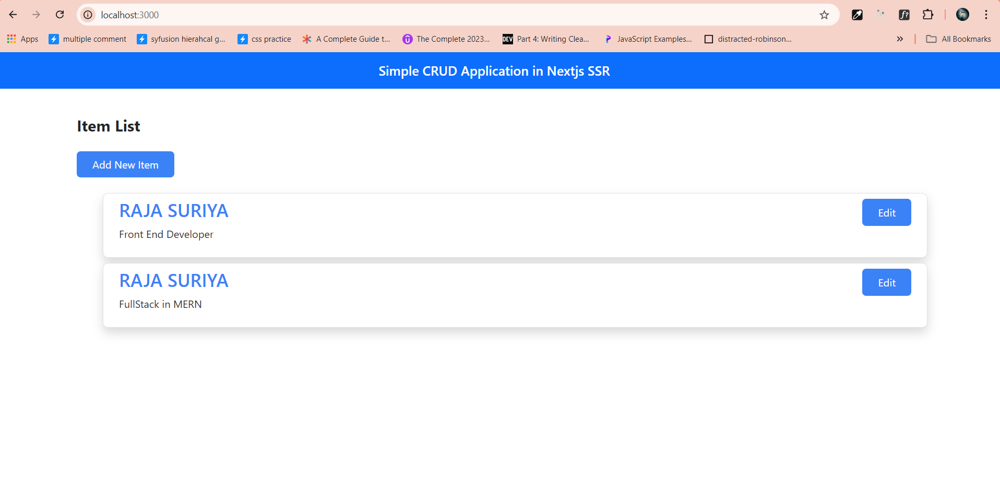
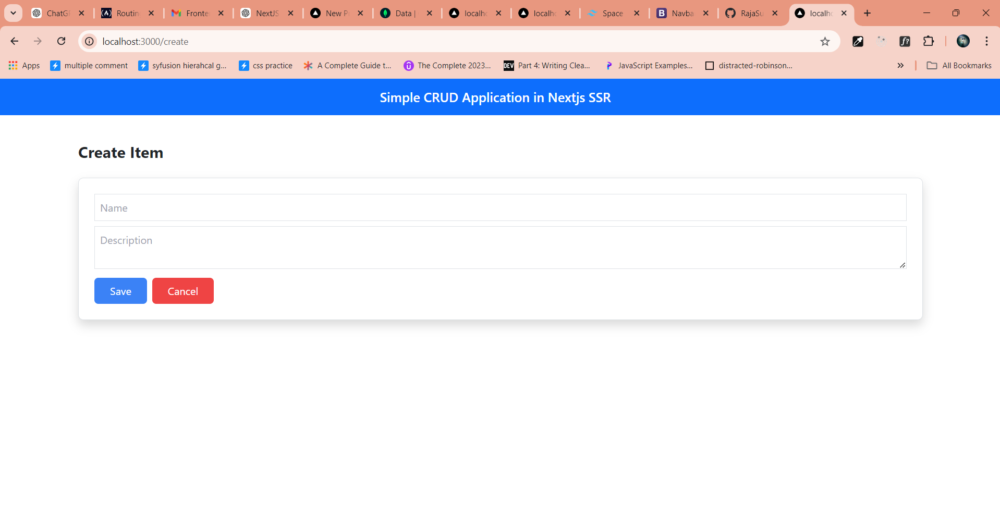
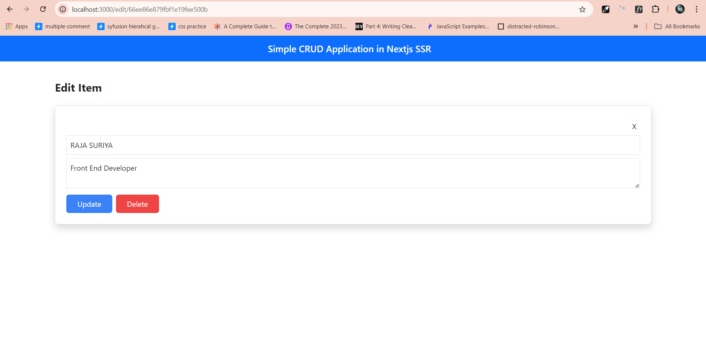

Next.js CRUD Application with Server-Side Rendering (SSR) and MongoDB
This project is a simple web application built using Next.js, MongoDB, Tailwind CSS, and Bootstrap. It demonstrates CRUD (Create, Read, Update, Delete) operations with Server-Side Rendering (SSR).

Table of Contents
Features
Project Structure
Getting Started
Running the Application
API Routes
Usage
Screenshots

Features
Server-Side Rendering (SSR): Fetch data server-side for improved SEO and faster initial loading.
CRUD Operations:
Create: Add new items to the MongoDB database.
Read: Retrieve and display items.
Update: Modify existing items.
Delete: Remove items from the database.
Styling: UI built using Tailwind CSS and Bootstrap for a responsive and clean interface.
Database: MongoDB for data storage, using Mongoose for schema modeling.

Getting Started
Prerequisites
Node.js v14 or later
MongoDB (Local or MongoDB Atlas)
Git (optional)

Running the Application
Start the Development Server:
npm run dev
Open the Application: Navigate to http://localhost:3000 in your browser.

API Routes
GET /api/items: Retrieve all items from the database.
GET /api/items/[id]: Retrieve a specific item by ID.
POST /api/items: Create a new item.
PUT /api/items/[id]: Update an item by ID.
DELETE /api/items/[id]: Delete an item by ID.

Usage
Create an Item
Go to the /create page.
Fill in the form with the item details.
Click "Submit" to add the item to the database.
Read Items
Navigate to the home page (/).
View the list of all items fetched from the database.
Update an Item
Click on an item to go to its detail page (/edit/[id]).
Modify the item's details.
Click "Update" to save the changes.
Delete an Item
Go to the item's detail page (/edit/[id]).
Click "Delete" to remove the item from the database.
Screenshots

License
This project is licensed under the MIT License